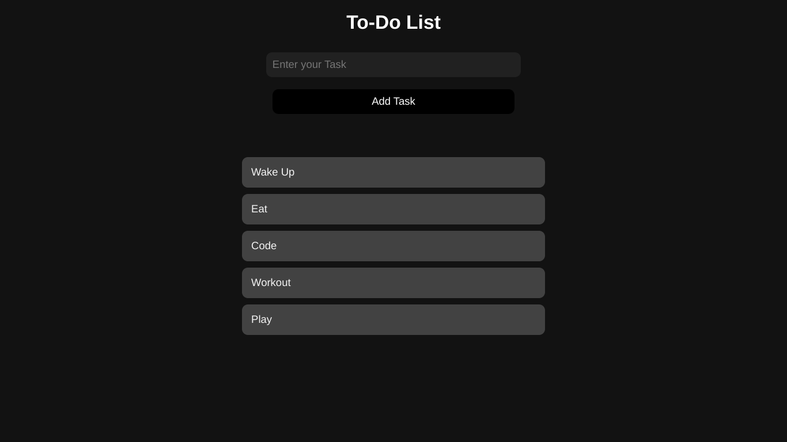

# 📝 To-Do List App

A simple and responsive To-Do List app built using **HTML**, **CSS**, and **JavaScript**. This app allows users to add and remove tasks dynamically, providing a smooth and interactive user experience.

## 🚀 Features

- **Add Task**: Add tasks with a single click.
- **Delete Task**: Remove tasks by clicking on the delete button.
- **Responsive Design**: Adapts to different screen sizes (mobile, tablet, and desktop).
- **User-Friendly Interface**: Clear and minimalistic design to keep the focus on tasks.
  
## 🔧 Technologies Used

- **HTML5**: For the structure of the web page.
- **CSS3**: For styling the page, ensuring responsiveness.
- **JavaScript**: For dynamic task management and interactivity.
- **Font Awesome**: For the task delete icons.

## 📸 Screenshots

### Home Page

## 🚧 Future Updates

- Add task editing functionality.
- Store tasks in local storage to persist after page reload.
- Improve task prioritization and categorization.
